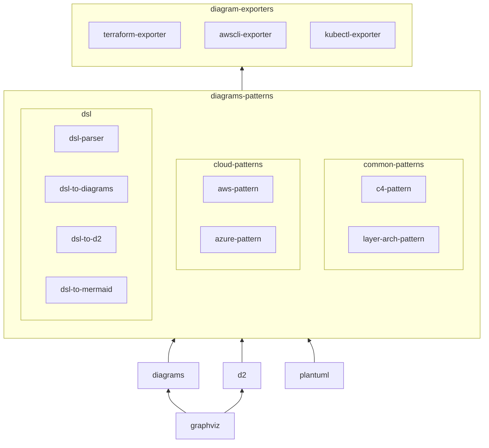

# diagrams-exporters

- in additional to the design phase, diagrams can aslo be used for analysis and monitoring the current architecture.
- to do that, we need to export the 'metadata' from other sources, e.g. terraform, aws cli, etc. then generate the diagrams.

**diagrams-exporters** export the metadata from existing tools, and generate the diagrams.

## Features

### :rocket: terraform graph

> <https://github.com/hashicorp/learn-terraform-no-code-provisioning>


> <https://github.com/hashicorp/learn-terraform-provision-eks-cluster>


> <https://github.com/hashicorp/learn-terraform-multicloud-kubernetes-eks>


### :construction: awscli scan
  - depends on the patterns in diagrams-patterns (e.g. vpc with igw, subnet and nat)


## Usage

Install the package:

```bash
pipx install diagrams-exporters
```

### terraform graph (only aws supported)

Exectute the following command in your terraform workspace, it will generate terraform graph and export to Diagrams.

```bash
diagrams-exporters terraform
# use -d to specify the output directory/file
diagrams-exporters terraform -o diagrams-exported
diagrams-exporters terraform -o dist/diagrams-exported
```

### dot graph (only terraform/aws supported)

If you have existing .dot file

```bash
diagrams-exporters dot -f existing.dot
diagrams-exporters dot -f existing.dot -o diagrams-exported
diagrams-exporters dot -f existing.dot -o dist/diagrams-exported
```

## Roadmap

Currently, the **diagrams-patterns** and diagrams-exporters are built as 'diagrams'-extensions. But since the diagrams is inactive, introducing new tools is a necessary step, e.g. d2.

At that time, the **diagrams-patterns** should be a standalone tool, which provide a standard DSL to describe the common patterns in cloud architecture (or other kinds of diagrams). Then, you can translate the DSL to different tools, e.g. diagrams, d2, etc.

The **diagrams-exporters** plays another role to facilitate with productive tools, e.g. terraform, aws cli, etc. It read the metadata, convert to DSL, then generate the diagrams.

A possible structure is:



## Reference

- graphviz & dot
  - <https://github.com/pydot/pydot>

- d2
  - <https://github.com/terrastruct/d2>
  - <https://github.com/MrBlenny/py-d2>

- read tfstate and generate graph
  - <https://github.com/cycloidio/inframap>
  - <https://github.com/28mm/blast-radius>

- read aws cli and generate graph
  - <https://github.com/Cloud-Architects/cloudiscovery>

- other terraform interesting tools
  - <https://github.com/cycloidio/terracost>
  - <https://pypi.org/project/python-hcl2/>
